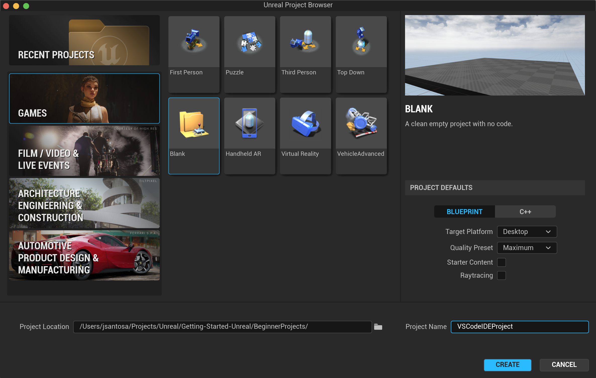
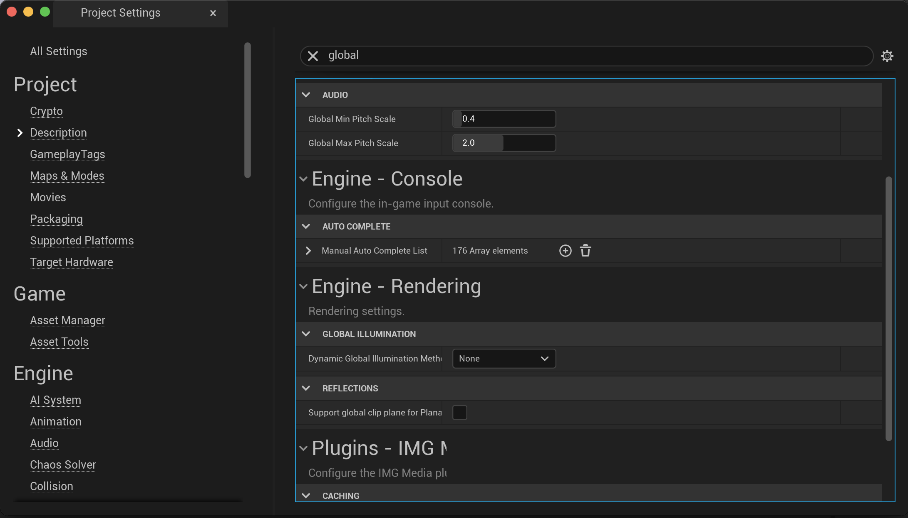
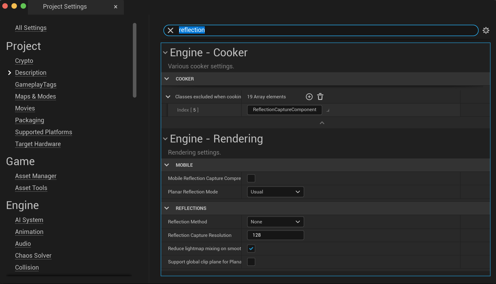
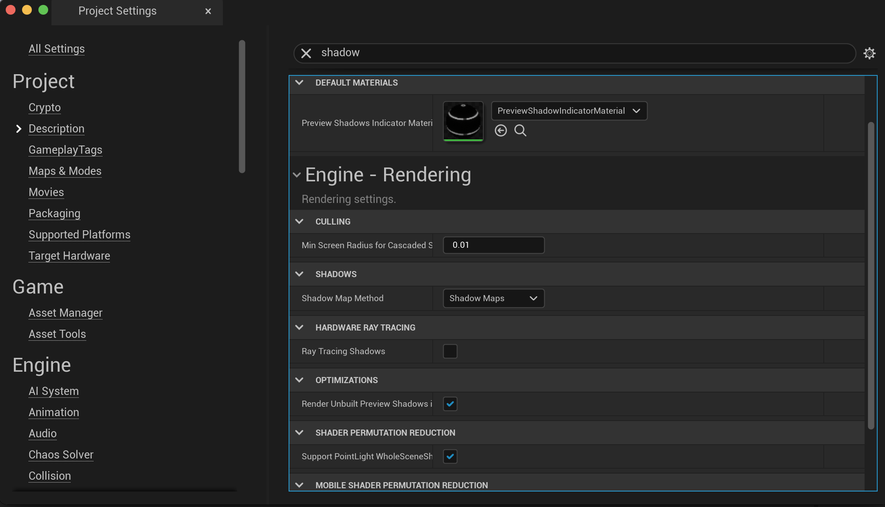
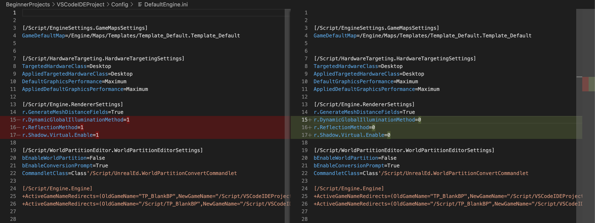
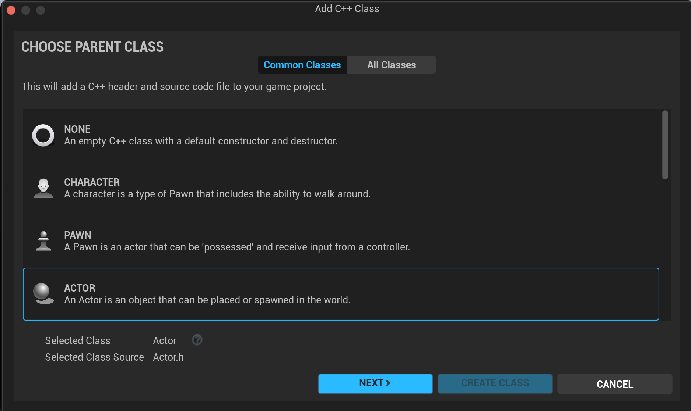
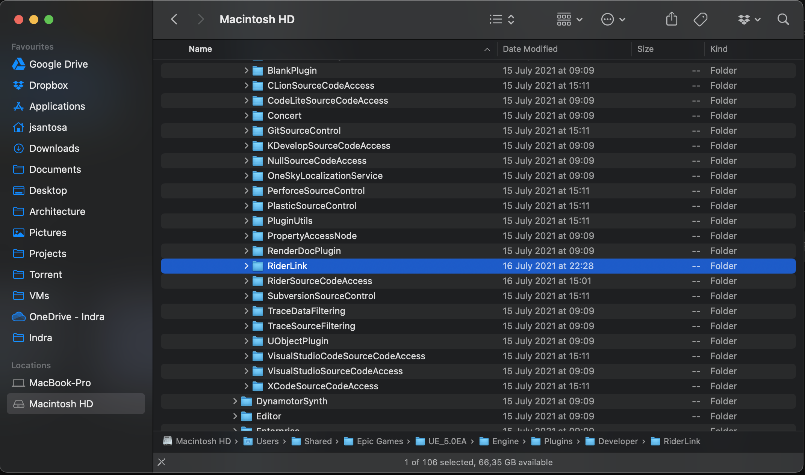

# How to Start in Unreal Engine

These examples teach the fundamental and some tips on how to create and develop games using Unreal Engine

## 1. Naming Convention

It is important to follow a naming conventions to use within the projects for folders, files, variables, etc..

[Unreal Style Guide](https://github.com/Allar/ue5-style-guide)

### 1.1 Identifiers

An `Identifier` is anything that resembles or serves as a "name". For example, the name of an asset, or the name of a material later, or a blueprint property, a variable, or a folder name, or for a data table row name, etc...

#### 1.1.1 Cases

There are a few different ways you can `CaseWordsWhenNaming`. Here are some common casing types:

##### PascalCase

Capitalize every word and remove all spaces, e.g. `DesertEagle`, `StyleGuide`, `ASeriesOfWords`.

##### camelCase

The first letter is always lowercase but every following word starts with uppercase, e.g. `desertEagle`, `styleGuide`, `aSeriesOfWords`.

##### Snake_case

Words can arbitrarily start upper or lowercase but words are separated by an underscore, e.g. `desert_Eagle`, `Style_Guide`, `a_Series_of_Words`.

#### 1.1.2 Forbidden Characters

In any `Identifier` of any kind, **never** use the following unless absolutely forced to:

* White space of any kind
* Backward slashes `\`
* Symbols i.e. `#!@$%`
* Any Unicode character

Any `Identifier` should strive to only have the following characters when possible (the RegEx `[A-Za-z0-9_]+`)

* ABCDEFGHIJKLMNOPQRSTUVWXYZ
* abcdefghijklmnopqrstuvwxyz
* 1234567890
* _ (sparingly)

### 1.2 Asset Naming Conventions

Naming conventions should be treated as law. A project that conforms to a naming convention is able to have its assets managed, searched, parsed, and maintained with incredible ease.

Most things are prefixed with prefixes being generally an acronym of the asset type followed by an underscore.

#### 1.1.1 Base Asset Name

A Base Asset Name represents a logical grouping of related assets. Any asset that is part of this logical group should follow the standard of `Prefix_BaseAssetName_Variant_Suffix`

* `Prefix` and `Suffix` are to be determined by the asset type through the *Asset Name Modifiers* tables.
* `BaseAssetName` should be determined by a short and easily recognizable name related to the context of this group of assets.

#### 1.1.2 Asset Name Modifiers

When naming an asset, use these tables to determine the `Prefix` and `Suffix` to use with an asset's Base Asset Name.

##### Most Common

| Asset Type              | Prefix     | Suffix     | Notes                            |
| ----------------------- | ---------- | ---------- | -------------------------------- |
| Level / Map             |            |            | [Should be in a folder called Maps.](#2.4) |
| Level (Persistent)      |            | _P         |                                  |
| Level (Audio)           |            | _Audio     |                                  |
| Level (Lighting)        |            | _Lighting  |                                  |
| Level (Geometry)        |            | _Geo       |                                  |
| Level (Gameplay)        |            | _Gameplay  |                                  |
| Blueprint               | BP_        |            |                                  |
| Material                | M_         |            |                                  |
| Static Mesh             | S_         |            | Many use SM_. We use S_.         |
| Skeletal Mesh           | SK_        |            |                                  |
| Texture                 | T_         | _?         | See [Textures](#anc-textures)    |
| Particle System         | PS_        |            |                                  |
| Widget Blueprint        | WBP_       |            |                                  |

##### Animations

| Asset Type              | Prefix     | Suffix     | Notes                            |
| ----------------------- | ---------- | ---------- | -------------------------------- |
| Aim Offset              | AO_        |            |                                  |
| Aim Offset 1D           | AO_        |            |                                  |
| Animation Blueprint     | ABP_       |            |                                  |
| Animation Composite     | AC_        |            |                                  |
| Animation Montage       | AM_        |            |                                  |
| Animation Sequence      | A_         |            |                                  |
| Blend Space             | BS_        |            |                                  |
| Blend Space 1D          | BS_        |            |                                  |
| Level Sequence          | LS_        |            |                                  |
| Morph Target            | MT_        |            |                                  |
| Paper Flipbook          | PFB_       |            |                                  |
| Rig                     | Rig_       |            |                                  |
| Skeletal Mesh           | SK_        |            |                                  |
| Skeleton                | SKEL_      |            |                                  |

##### Artificial Intelligence

| Asset Type              | Prefix     | Suffix     | Notes                            |
| ----------------------- | ---------- | ---------- | -------------------------------- |
| AI Controller           | AIC_       |            |                                  |
| Behavior Tree           | BT_        |            |                                  |
| Blackboard              | BB_        |            |                                  |
| Decorator               | BTDecorator_ |          |                                  |
| Service                 | BTService_ |            |                                  |
| Task                    | BTTask_    |            |                                  |
| Environment Query       | EQS_       |            |                                  |
| EnvQueryContext         | EQS_       | Context    |                                  |

##### Blueprints

| Asset Type              | Prefix     | Suffix     | Notes                            |
| ----------------------- | ---------- | ---------- | -------------------------------- |
| Blueprint               | BP_        |            |                                  |
| Blueprint Component	  | BP_	       | Component  | I.e. BP_InventoryComponent       |
| Blueprint Function Library | BPFL_   |            |                                  |
| Blueprint Interface     | BPI_       |            |                                  |
| Blueprint Macro Library | BPML_      |            | Do not use macro libraries if possible. |
| Enumeration             | E          |            | No underscore.                   |
| Structure               | F or S     |            | No underscore.                   |
| Tutorial Blueprint      | TBP_       |            |                                  |
| Widget Blueprint        | WBP_       |            |                                  |

##### Materials

| Asset Type                    | Prefix     | Suffix     | Notes                            |
| ----------------------------- | ---------- | ---------- | -------------------------------- |
| Material                      | M_         |            |                                  |
| Material (Post Process)       | PP_        |            |                                  |
| Material Function             | MF_        |            |                                  |
| Material Instance             | MI_        |            |                                  |
| Material Parameter Collection | MPC_       |            |                                  |
| Subsurface Profile            | SP_        |            |                                  |
| Physical Materials            | PM_        |            |                                  |
| Decal                         | M_, MI_    | _Decal     |                                  |

##### Textures

| Asset Type              | Prefix     | Suffix     | Notes                            |
| ----------------------- | ---------- | ---------- | -------------------------------- |
| Texture                 | T_         |            |                                  |
| Texture (Diffuse/Albedo/Base Color)| T_ | _D      |                                  |
| Texture (Normal)        | T_         | _N         |                                  |
| Texture (Roughness)     | T_         | _R         |                                  |
| Texture (Alpha/Opacity) | T_         | _A         |                                  |
| Texture (Ambient Occlusion) | T_     | _O         |                                  |
| Texture (Bump)          | T_         | _B         |                                  |
| Texture (Emissive)      | T_         | _E         |                                  |
| Texture (Mask)          | T_         | _M         |                                  |
| Texture (Specular)      | T_         | _S         |                                  |
| Texture (Metallic)      | T_         | _M         |                                  |
| Texture (Packed)        | T_         | _*         | See notes below about [packing](#anc-textures-packing). |
| Texture Cube            | TC_        |            |                                  |
| Media Texture           | MT_        |            |                                  |
| Render Target           | RT_        |            |                                  |
| Cube Render Target      | RTC_       |            |                                  |
| Texture Light Profile   | TLP        |   

##### Miscellaneous

| Asset Type                 | Prefix     | Suffix     | Notes                            |
| -------------------------- | ---------- | ---------- | -------------------------------- |
| Animated Vector Field      | VFA_       |            |                                  |
| Camera Anim                | CA_        |            |                                  |
| Color Curve                | Curve_     | _Color     |                                  |
| Curve Table                | Curve_     | _Table     |                                  |
| Data Asset                 | *_         |            | Prefix should be based on class. |
| Data Table                 | DT_        |            |                                  |
| Float Curve                | Curve_     | _Float     |                                  |
| Foliage Type               | FT_        |            |                                  |
| Force Feedback Effect      | FFE_       |            |                                  |
| Landscape Grass Type       | LG_        |            |                                  |
| Landscape Layer            | LL_        |            |                                  |
| Matinee Data               | Matinee_   |            |                                  |
| Media Player               | MP_        |            |                                  |
| Object Library             | OL_        |            |                                  |
| Redirector                 |            |            | These should be fixed up ASAP.   |
| Sprite Sheet               | SS_        |            |                                  |
| Static Vector Field        | VF_        |            |                                  |
| Substance Graph Instance   | SGI_       |            |                                  |
| Substance Instance Factory | SIF_       |            |                                  |
| Touch Interface Setup      | TI_        |            |                                  |
| Vector Curve               | Curve_     | _Vector    |                                  |

##### Paper 2D

| Asset Type              | Prefix     | Suffix     | Notes                            |
| ----------------------- | ---------- | ---------- | -------------------------------- |
| Paper Flipbook          | PFB_       |            |                                  |
| Sprite                  | SPR_       |            |                                  |
| Sprite Atlas Group      | SPRG_      |            |                                  |
| Tile Map                | TM_        |            |                                  |
| Tile Set                | TS_        |            |                                  |

##### Physics

| Asset Type              | Prefix     | Suffix     | Notes                            |
| ----------------------- | ---------- | ---------- | -------------------------------- |
| Physical Material       | PM_        |            |                                  |
| Physics Asset	          | PHYS_      |            |                                  |
| Destructible Mesh       | DM_        |            |                                  |

##### Sounds

| Asset Type              | Prefix     | Suffix     | Notes                            |
| ----------------------- | ---------- | ---------- | -------------------------------- |
| Dialogue Voice          | DV_        |            |                                  |
| Dialogue Wave           | DW_        |            |                                  |
| Media Sound Wave        | MSW_       |            |                                  |
| Reverb Effect           | Reverb_    |            |                                  |
| Sound Attenuation       | ATT_       |            |                                  |
| Sound Class             |            |            | No prefix/suffix. Should be put in a folder called SoundClasses |
| Sound Concurrency       |            | _SC        | Should be named after a SoundClass |
| Sound Cue               | A_         | _Cue       |                                  |
| Sound Mix               | Mix_       |            |                                  |
| Sound Wave              | A_         |            |                                  |

##### User Interface

| Asset Type              | Prefix     | Suffix     | Notes                            |
| ----------------------- | ---------- | ---------- | -------------------------------- |
| Font                    | Font_      |            |                                  |
| Slate Brush             | Brush_     |            |                                  |
| Slate Widget Style      | Style_     |            |                                  |
| Widget Blueprint        | WBP_       |            |                                  |

##### Effects

| Asset Type              | Prefix     | Suffix     | Notes                            |
| ----------------------- | ---------- | ---------- | -------------------------------- |
| Particle System         | PS_        |            |                                  |
| Material (Post Process) | PP_        |            |                                  |


#### 1.1.3 Examples

| Asset Type              | Asset Name                                                 |
| ----------------------- | ---------------------------------------------------------- |
| Skeletal Mesh           | SK_Bob                                                     |
| Material                | M_Bob                                                      |
| Texture (Diffuse/Albedo)| T_Bob_D                                                    |
| Texture (Normal)        | T_Bob_N                                                    |
| Texture (Evil Diffuse)  | T_Bob_Evil_D                                               |
| Static Mesh (01)        | S_Rock_01                                                  |
| Static Mesh (02)        | S_Rock_02                                                  |
| Static Mesh (03)        | S_Rock_03                                                  |
| Material                | M_Rock                                                     |
| Material Instance (Snow)| MI_Rock_Snow                                               |

### 1.3 Content Directory Structure

Equally important as asset names, the directory structure style of a project should be considered law. Asset naming conventions and content directory structure go hand in hand, and a violation of either causes unneeded chaos.

### 1.3.1 Folder Names

These are common rules for naming any folder in the content structure.

* Always Use PascalCase For example, `DesertEagle`, `RocketPistol`, and `ASeriesOfWords`.
* Never Use Spaces
* Never Use Unicode Characters And Other Symbols
* Use A Top Level Folder For Project Specific Assets i.e `Content/GenericShooter`.
* No Global Assets
* Reduce Migration Conflicts
* Master Material Example. i.e  `Content/MaterialLibrary/M_Master`
* Samples, Templates, and Marketplace Content Are Risk-Free
* DLC, Sub-Projects, and Patches Are Easily Maintained
* All Map Files Belong In A Folder Called `Maps`
* Use A `Core` Folder For Critical Blueprints And Other Assets. i.e `/Content/Project/Core`
* Do Not Create Folders Called `Assets` or `AssetTypes`
* Creating a folder named `Assets` , `Meshes`, `Textures`, or `Materials` is redundant.
* Very Large Asset Sets Get Their Own Folder Layout
* Create a `MaterialLibrary` folder to use of master materials, layered materials, or any form of reusable materials or textures that do not belong to any subset of assets. i.e Content/Project/MaterialLibrary
* No Empty Folders

Some subdirectories are common amongst both the Engine and game project directories:

* **Binaries** - Contains executable files or other files created during compiling.
* **Build** - Holds files needed for building the engine or game, including files necessary for creating platform-specific builds.
* **Config** - Configuration files for setting values that control engine behavior. Values set in the game project Config files override the values set in the Engine\Config * directory.
* **Content** - Holds content for the engine or game, including asset packages and maps.
* **DerivedDataCache** - Contains derived data files generated on-load for referenced content. Not having cache files present for referenced content can increase load times * dramatically.
* **Intermediate** - Contains temporary files generated during building the engine or game. In game directories, Shaders are stored in the Intermediate directory.
* **Saved** - Contains autosaves, configuration (.ini) files, and log files. Additionally, the Engine > Saved directory contains crash logs, hardware information, and Swarm options and data.
* **Plugins** - Contains plugins to be added specifically into the project. These folder contains the source code and binaries to be build by the engine.
* **Source** - Contains all of the source files for engine or game, including the engine source code, tools, gameplay classes, etc.
  * **Engine** - Source files in the Engine directory are categorized into the following:
    * Developer - Files used by both the editor and engine.
    * Editor - Files used by just the editor.
    * Programs - External tools used by the engine or editor.
    * Runtime - Files used by just the engine. 
  * **Game** - Source files in a game project directory are organized by module; one directory per module. Each module contains the following:
    * Classes - Contains all gameplay class header (.h) files.
    * Private - Contains all .cpp files including gameplay class implementation files and the module implementation file.
    * Public - Contains the module header file. 

#### 1.3.2 Example Project Content Structure

Following is an example of a content structure.

```bash
|-- Content
    |-- GenericShooter
        |-- Art
        |   |-- Industrial
        |   |   |-- Ambient
        |   |   |-- Machinery
        |   |   |-- Pipes
        |   |-- Nature
        |   |   |-- Ambient
        |   |   |-- Foliage
        |   |   |-- Rocks
        |   |   |-- Trees
        |   |-- Office
        |-- Characters
        |   |-- Bob
        |   |-- Common
        |   |   |-- Animations
        |   |   |-- Audio
        |   |-- Jack
        |   |-- Steve
        |   |-- Zoe
        |-- Core
        |   |-- Characters
        |   |-- Engine
        |   |-- GameModes
        |   |-- Interactables
        |   |-- Pickups
        |   |-- Weapons
        |-- Effects
        |   |-- Electrical
        |   |-- Fire
        |   |-- Weather
        |-- Maps
        |   |-- Campaign1
        |   |-- Campaign2
        |   |-- Episode(_Number)
        |   |-- TestMaps
        |-- MaterialLibrary
        |   |-- Debug
        |   |-- Metal
        |   |-- Paint
        |   |-- Utility
        |   |-- Weathering
        |-- Environments
        |   |-- Background
        |   |-- Buildings
        |   |-- Foliage
        |   |-- Props
        |   |-- Sky
        |-- Placeables
        |   |-- Pickups
        |-- Weapons
            |-- Common
            |-- Pistols
            |   |-- DesertEagle
            |   |-- RocketPistol
            |-- Rifles
```

### 1.4 Blueprints

#### 1.4.1 Variables

The words `variable` and `property` may be used interchangeably.

* All non-boolean variable names must be clear, unambiguous, and descriptive nouns.
* All non-boolean variables should be in the form of `PascalCase`. i.e `Score`, `Kills`, `TargetPlayer`, `AbilityID`
* All booleans should be named in `PascalCase` but prefixed with a lowercase `b`.
* All booleans should use general and independent state information. i.e Use `bDead` and `bHostile` **not** `bIsDead` and `bIsHostile`.
* Complex States. Try to not use verbs such as `bRunning` or `bWalking`. Verbs tend to lead to complex states.
* Do not include atomic type names. i.e Use `Score`, `Kills`, and `Description` **not** `ScoreFloat`, `FloatKills`, `DescriptionString`.
* Do Include Non-Atomic Type Names. i.e: Use `Hat`, `Flag`, and `Ability` **not** `MyHat`, `MyFlag`, and `PlayerAbility`.
* Arrays follow the same naming rules as above, but should be named as a **plural** noun. i.e: Use `Targets`, `Hats`, and `EnemyPlayers`, **not** `TargetList`, `HatArray`, `EnemyPlayerArray`.
* All variables that are safe to change the value of in order to configure behavior of a blueprint should be marked as `Editable`.
* All `Editable` variables, including those marked editable just so they can be marked as `Expose On Spawn`, should have a description in their `Tooltip` fields that explains how changing this value affects the behavior of the blueprint.
* All `Editable` variables should make use of **slider** and **value** ranges if there is ever a value that a variable should _not_ be set to.
* Categories. You can define sub-categories by using the pipe character `|`. i.e. `Config | Animations`.
* Variable Access Level. Treat `Editable` variables as **public** variables. Treat non-editable variables as **protected** variables.
* **Private** Variables. Unless it is known that a variable should only be accessed within the class it is defin`ed and never a child class, do not mark variables as **private**
* `Transient Variables`. Transient variables are variables that do not need to have their value saved and loaded and have an initial value of zero or null.
Because of this, all transient variables should always be initialized as zero or null. To do otherwise would result in hard to debug errors.
s
##### Examples

Consider a Blueprint called `BP_PlayerCharacter`.

**Bad**

* `PlayerScore`
* `PlayerKills`
* `MyTargetPlayer`
* `MyCharacterName`
* `CharacterSkills`
* `ChosenCharacterSkin`

All of these variables are named redundantly. It is implied that the variable is representative of the `BP_PlayerCharacter` it belongs to because it is `BP_PlayerCharacter` that is defining these variables.

**Good**

* `Score`
* `Kills`
* `TargetPlayer`
* `Name`
* `Skills`
* `Skin`

#### 1.4.2 Functions, Events, and Event Dispatchers

This section describes how you should author functions, events, and event dispatchers. Everything that applies to functions also applies to events, unless otherwise noted.

* All Functions Should Be Verbs. i.e `Fire` , `Jump`, `GetCoordinates`, `UpdateTransforms` **not** `Rock`, `PlayerState` or `Color`.
* Property RepNotify Functions Always `OnRep_Variable`
* Info Functions Returning Bool Should Ask Question. i.e `IsDead`,`IsAlive`,`HasWeapon` **not** `Fire`, `OnFire` or `Visibility`
* Event Handlers and Dispatchers Should Start With `On`. i.e `OnDeath` , `OnMessageRecieved`, `OnClick`
* Remote Procedure Calls Should Be Prefixed With Target, `Server`, `Client`, or `Multicast`. i.e `ServerFireWeapon`,`ClientNotifyDeath` or `MulticastSpawnTracerEffect`
* All Functions Must Have Return Nodes
* No Function Should Have More Than 50 Nodes

### 1.5 Classes

Source Code files also must use a naming convention such as Classes, Interfaces, Enums, etc..

[Unreal Coding Standards](https://docs.unrealengine.com/4.26/en-US/ProductionPipelines/DevelopmentSetup/CodingStandard/)

* The first letter of each word in a name (such as type name or variable name) is capitalized, and there is usually no underscore between words. For example, `Health` and `UPrimitiveComponent` are correct, but **not** `lastMouseCoordinates` or `delta_coordinates`.
* Type names are prefixed with an additional upper-case letter to distinguish them from variable names. For example, `FSkin` is a **type** name, and `Skin` is an **instance** of a `FSkin`.
  * `Template` classes are prefixed by T.
  * Classes that inherit from `UObject` are prefixed by U.
  * Classes that inherit from `AActor` are prefixed by A.
  * Classes that inherit from `SWidget` are prefixed by S.
  * Classes that are abstract `interfaces` are prefixed by I.
  * `Enums` are prefixed by E.
  * `Boolean` variables must be prefixed by b (for example, bPendingDestruction, or bHasFadedIn).
  * Most other classes are prefixed by F, though some subsystems use other letters.
  * `Typedefs` should be prefixed by whatever is appropriate for that type: F if it's a typedef of a `struct`, U if it's a typedef of a UObject and so on.

    A typedef of a particular template instantiation is no longer a template, and should be prefixed accordingly, for example:

    ```c
    typedef TArray<FMytype> FArrayOfMyTypes;
    ```

  * Prefixes are omitted in C#.
  * `UnrealHeaderTool` requires the correct prefixes in most cases, so it's important to provide them.
* `Type` and `variable` names are nouns.
* Method names are verbs that describe the method's effect, or describe the return value of a method that has no effect.

## 2. Create Project

### 2.1 Default Options

First we need to crate an empty or base project from a template.

> Do not select `C++` option. Select `Blueprint` option instead, so we can add source code later.



Select the code editor or IDE, depending on workflows, requirements, licenses or speed in development.

`Editor Preferences -> General -> Source Code -> Accessor -> Source Code Editor`


Select the default location for the Asset Editor.

`Editor Preferences -> General -> Appearance -> User Interface -> Asset Editor Open Location -> Main Window`


Turn Off `Realtime` within from the `Viewport options` menu.


Disable `Lumen` rendering method to increase performances within the editor in `Project Settings`.

> Search for `global` and `reflection` to disable the `lumen` features more quicly

`Project Settings -> Engine -> Rendering -> Global Illumination -> Dynamic Global Illumination Method -> None`



`Project Settings -> Engine -> Rendering -> Reflections -> Reflection Method -> None`



Disable `Virtual Shadow Maps (Beta)` method to increase performances within the editor in `Project Settings`.

> Search for `shadow` to disable `Virtual Shadow Maps (Beta)`.

`Edit -> Project Settings -> Rendering -> Shadows -> Shadow Map Method -> Shadow Maps`



These changes modifies the configuration file at `Config/DefaultEngine.ini`



#### 2.3 Configure IDE

##### 2.3.1 Visual Studio Code IDE

[Unreal C++ with Visual Studio Code](http://jollymonsterstudio.com/2018/11/02/unreal-c-with-visual-studio-code/)

**Visual Studio Code** is a fairly lean IDE based on the Electron framework that was designed to tap into the market of Sublime, Atom, etc etc but it works just fine as a C++ editor.

There are a few prerequisites you need to have installed to follow this tutorial:

* Ensure that you the following packages installed depending on your OS:
  * **Windows**: *Visual Studio Community 2017* installed or alternatively just the *Visual Studio Build Tools* as you need something to still compile the code. Visual Studio Code will recognize what you have these packages installed and assign the correct compiler configurations
  * **MacOS**: XCode 12 installed to compile shaders and c++ code.
* **Unreal Engine** > v4.20.X
* **Visual Studio Code**

Once you have these pieces installed, let’s move onto the Unreal Editor configuration

* Open Unreal Editor ( source or binary doesn’t matter )
* Go to `Edit -> Editor Preferences`
* Then go to `General -> Source Code -> Source Code Editor` and select `Visual Studio Code`
* Once this is done you should now be able to:
  * Create a new C++ Class using `Tools -> New C++ Class...`
  * Generate a new Visual Studio Code project using `Tools -> Generate Visual Studio Code Project`
* To open up Visual Studio Code go to `Tools -> Open Visual Studio Code`


This must be generate the following folders and files within the project.

```bash
.vscode/
[PROJECTNAME].code-workspace
```

You should now be able to see the IDE getting launched from Unreal and your project available for compilation.

In case these files are not generated, it can be manually created by running the following command.

```bash
export BUILD_TOOL_PATH="/Users/Shared/Epic Games/UE_5.0EA/Engine/Binaries/DotNET/UnrealBuildTool/UnrealBuildTool"
export PROJECT_PATH="/Users/jsantosa/Projects/Unreal/Getting-Started-Unreal/BeginnerProjects/VSCodeIDEProject/VSCodeIDEProject.uproject"
$BUILD_TOOL_PATH -projectfiles -project=$PROJECT_PATH -game -Engine -rocket -progress -VSCode
```

The only other thing you need to be aware of is how to get at the build targets.

To do so you can go to `Terminal` -> `Run` Build Task or simply hit `CTRL + SHIFT + B`

##### Additional Information

The only other thing you may want to setup within Visual Studio Code are a number of plugins that assist with intellisense, auto complete, etc.

Here is a list of plugins I currently have configured:

* C/C++
* C/C++ Clang Command Adapter
* C#
* C++ Intellisense
* Clang-Format
* Unreal Engine 4 Snippets

In case you are not happy with Visual Studio Code and want to revert things back to use Visual Studio I recommend cleaning up the files the VS Code integration generated.

Specifically the following folders / files inside of your root project:

```bash
.vscode/
[PROJECTNAME].code-workspace
```

Once this is complete you simply follow the initial set of instructions but instead of picking VS Code just select Visual Studio 2015/2017. This should then give you the option to re-generate the Visual Studio project within Unreal Editor ( File -> Refresh / Generate Visual Studio Project )

##### 2.3.2 Rider for Unreal IDE

#### 2.4 Create Actor Class

Create a new C++ Class using `Tools -> New C++ Class...`


Select the Parent Class (inheritance Class). Click on `All Classes` to view the complete list of classes available.



Choose a `Name`, following the naming convention depending on the class/file type created. Also select the `Path` folder to use to store the class, depending on the module, behavior and domain specific.

> When creating **modules** it is a good practice to split the header (*.h*) and implementation (*.cpp*) files into `public` and `private` folder structure.


Generate a new Visual Studio Code project using `Tools -> Generate Visual Studio Code Project`

To open up Visual Studio Code go to `Tools -> Open Visual Studio Code`

##### FAQ

* **Error** compiling the code after creating the class.

  ```txt
  ERROR: Expecting to find a type to be declared in a module rules named ‘RD’ in UE5Rules, Version=0.0.0.0, Culture=neutral, PublicKeyToken=null. This type must derive from the ‘ModuleRules’ type defined by Unreal Build Tool.
  ```

  

  Remove following folder at `/Epic Games/UE_5.0EA/Engine/Plugins/Developer/Riderlink`. This plugin must be installed in the **Game** not globally in the **Engine**.

  