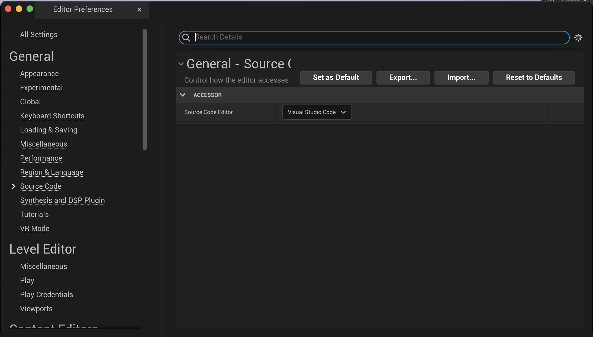
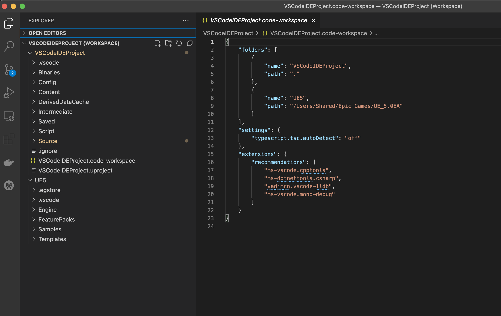
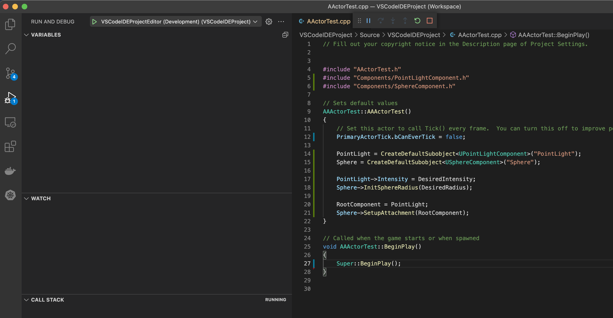

# README

Because each computer and operative system has it's own configuration it is needed to generate this configuration each time.

Configure Unreal Editor to generate a `Visual Studio Code` Workspace.

* Open Unreal Editor ( source or binary doesn’t matter )
* Go to `Edit -> Editor Preferences`
* Then go to `General -> Source Code -> Source Code Editor` and select `Visual Studio Code`
* Once this is done you should now be able to:
  * Create a new C++ Class using `Tools -> New C++ Class...`
  * Generate a new Visual Studio Code project using `Tools -> Generate Visual Studio Code Project`
* To open up Visual Studio Code go to `Tools -> Open Visual Studio Code`



This must be generate the following folders and files within the project.

```bash
.vscode/
[PROJECTNAME].code-workspace
```

You should now be able to see the IDE getting launched from Unreal and your project available for compilation.



In case these files are not generated, it can be manually created by running the following command.

```bash
export BUILD_TOOL_PATH="/Users/Shared/Epic Games/UE_5.0EA/Engine/Binaries/DotNET/UnrealBuildTool/UnrealBuildTool"
export PROJECT_PATH="/Users/jsantosa/Projects/Unreal/Getting-Started-Unreal/BeginnerProjects/VSCodeIDEProject/VSCodeIDEProject.uproject"
$BUILD_TOOL_PATH -projectfiles -project=$PROJECT_PATH -game -Engine -rocket -progress -VSCode
```

The only other thing you need to be aware of is how to get at the build targets.

To do so you can go to `Terminal` -> `Run Build Task` or simply hit `CTRL + SHIFT + B`

> Select `VSCodeIDEProjectEditor (Development)' to build and generate the libraries

